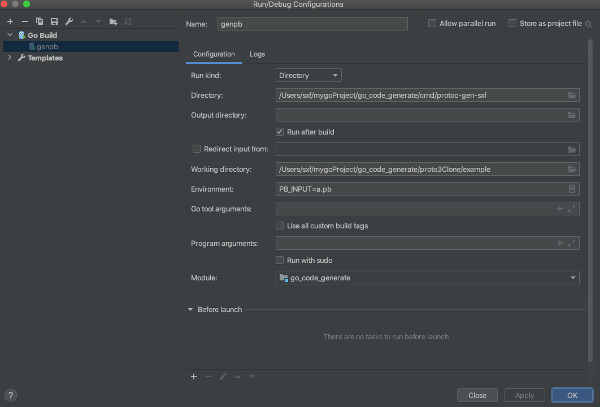

### 如果想要启动调试，需要配置一下goland，如下图：
 

### 生成proto的序列化文件，充当main函数启动时读取的文件流来源
```
    cd /proto3Clone/example
    
    PB_OUTPUT=a.pb protoc --proto_path=. --sxf_out=plugins=clone,paths=source_relative:. example.proto
```